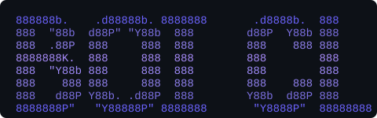

<p align="center">
  
  <br>
  
  
  
  
</p>

<p align="center">
  
</p>

<h3 align="center">An AI team of 6 personas in your terminal. One binary. No server.</h3>

---

> **Architecture transition:** the owner-approved BOI Agent Suit direction now
> uses one Core Persona (`boi`), a user-named Agent instance, Provider capability
> qualification, and six system Blocks. The feature text below describes the
> current v0.3 implementation and contains known legacy claims. Continue work
> from [HANDOFF.md](HANDOFF.md).

## 🚀 Get Started

### 1. Install
```bash
# Download from GitHub Releases → extract → add to PATH
# Or: go install github.com/boi-family/boi-cli/cmd/boi@latest
```

### 2. Setup
```bash
boi setup
```
TUI wizard — asks how many providers, then arrow-key pick from 10 providers,
enter API key, select model from curated list. Add 2+ for auto-fallback with rotation.

### 3. Pick Persona
```bash
boi persona wizard
```
6 personalities — each says hi. Pick your thinking style.

### 4. Launch
```bash
boi                        # Splash → Enter → Chat
boi ask "hello" --verbose  # Or CLI mode
```

> First run auto-detects and walks you through setup. No API keys? Runs in simulated mode.

---

## ✨ Features

| | |
|---|---|
| 🔌 **PSC Rotation** | 10+ providers with auto-fallback + `████░░` usage bar — rotate before exhaustion |
| 🎭 **6 Personas** | Switch between specialized AI profiles — each with unique system prompt & provider binding |
| 🎨 **TUI Wizard** | Bubbletea setup wizard — arrow keys, model picker, endpoint registry (70+ models) |
| 💾 **Phantom DB** | File-based memory with weight engine — remembers what matters across sessions |
| ⌨️ **Command Palette** | Type `/` for commands, Tab to autocomplete — `/provider` `/model` `/clear` |
| 🖥️ **TUI + CLI** | Full-screen terminal UI with bubble chat or direct CLI — your choice |

---

## 🧩 Personas

| Persona | Role | Model | Temp |
|---------|------|-------|------|
| **kamkaew** | Runtime Orchestration *(default)* | gpt-4.1-mini | 0.5 |
| **boi** | Architecture & System Design | claude-sonnet-5 | 0.4 |
| **kampun** | Knowledge Mining & Pattern Analysis | claude-sonnet-5 | 0.3 |
| **dang** | Debug & Code Specialist | gpt-4.1-mini | 0.2 |
| **don** | Research & Documentation | gpt-4.1-nano | 0.5 |
| **kine** | Creative Design & Imagination | gpt-4o | 0.8 |

```bash
boi persona list              # View all
boi persona switch dang       # Switch persona
boi ask "debug this" -p dang  # Use for one query
```

---

## 📖 Commands

| Command | Description |
|---------|-------------|
| `boi` | Launch TUI (full-screen terminal) |
| `boi setup` | TUI wizard — configure providers with arrow keys |
| `boi ask "..."` | AI agent query (ReAct loop) |
| `boi persona list/switch/wizard` | Manage personas |
| `boi provider list/switch` | Manage LLM providers |
| `boi model <name>` | Set default model |
| `boi config` | View configuration |
| `boi upgrade` | Self-update to latest |
| `boi version` | Show version |

---

## 📸 Screenshot

```
┌─ BOI CLI  [Mid] ─── Persona: kampun ── openai ████░░  idle ✓ ──────┐
├──────────────────────────────────────────────────────────────────────┤
│                                                                      │
│ ╭─ ▶ You                                            15:04 ──────────╮│
│ │                                                                   ││
│ │  login bug เกิดจากอะไร                                             ││
│ │                                                                   ││
│ ╰───────────────────────────────────────────────────────────────────╯│
│                                                                      │
│ ╭─ ◆ BOI · openai/gpt-4.1-mini · 450 tok            15:04 ─────────╮│
│ │                                                                   ││
│ │  Root cause: special characters in password                       ││
│ │  Fixed by URL-encoding in auth.js line 45                         ││
│ │                                                                   ││
│ ╰───────────────────────────────────────────────────────────────────╯│
│                                                                      │
├──────────────────────────────────────────────────────────────────────┤
│ > login bug มันเกิดจากอะไรครับ                                        │
├──────────────────────────────────────────────────────────────────────┤
│ ▸ /help  /persona  /clear  /provider  /model                        │
└──────────────────────────────────────────────────────────────────────┘
```

---

## ❓ FAQ

**Do I need a server or database?** No. Single Go binary (15 MB). Everything lives in `.boi/`.

**Does it work without an API key?** Yes — simulated mode. Run `boi setup` for real AI.

**How many providers can I chain?** Up to 20. Auto-rotate when near limit — status bar shows `████░░`.

**How is this different from Claude Code / Codex CLI?** 6 specialized personas, TUI setup wizard with model picker, auto-fallback rotation with usage %, chat bubbles with metadata — all as a single binary.

---

<p align="center">
  <a href="https://github.com/wersoul-source/BOI-CLI">
    
  </a>
</p>

<p align="center">
  <b>BOI CLI</b> — Built by <b>Kampun (คำปัน)</b> &amp; the <b>BOI Family</b><br>
  <sub>MIT License · July 2026</sub>
</p>
